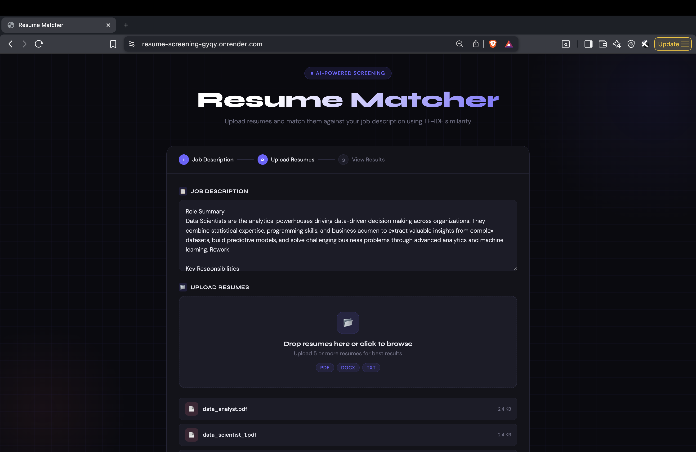
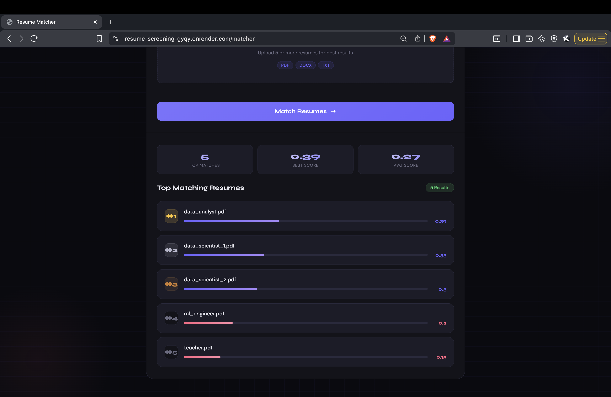

# Resume Screening App (AI-Powered)

An intelligent resume screening system that leverages **Natural Language Processing (NLP)** to match resumes with job descriptions using **TF-IDF vectorization and cosine similarity**.

---

##  Overview

This project automates the initial resume screening process by analyzing textual similarity between resumes and job descriptions. It helps recruiters quickly identify the most relevant candidates.

---

##  Key Features

*  Upload multiple resumes (PDF, DOCX, TXT)
*  NLP-based similarity matching (TF-IDF + Cosine Similarity)
*  Displays **Top 5 ranked resumes** with scores
*  Clean and interactive dark-themed UI
*  Fast and lightweight Flask backend

---

##  Tech Stack

* **Backend:** Python, Flask
* **Machine Learning:** Scikit-learn (TF-IDF, Cosine Similarity)
* **File Processing:** PyPDF, docx2txt
* **Frontend:** HTML, CSS, Bootstrap


## How to Run Locally

```bash
git clone https://github.com/your-username/resume-screening.git
cd resume-screening

pip install -r requirements.txt
python main.py
```

---

## How It Works

1. Extract text from resumes (PDF/DOCX/TXT)
2. Convert text into numerical vectors using TF-IDF
3. Compute similarity using cosine similarity
4. Rank resumes based on relevance to job description

---

## Future Improvements

* Use advanced NLP models (BERT / Sentence Transformers)
* Add resume classification (Data Science, Web Dev, etc.)
* Deploy as a live web application
* Add visualization dashboard

---

## Use Case

Ideal for recruiters, HR systems, and automation tools for filtering large volumes of resumes efficiently.

---

## 📬 Author

Prateek Yadav

## 📸 Screenshots

### Upload Page


### Result Page
